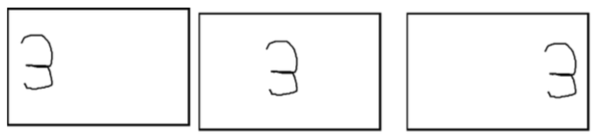
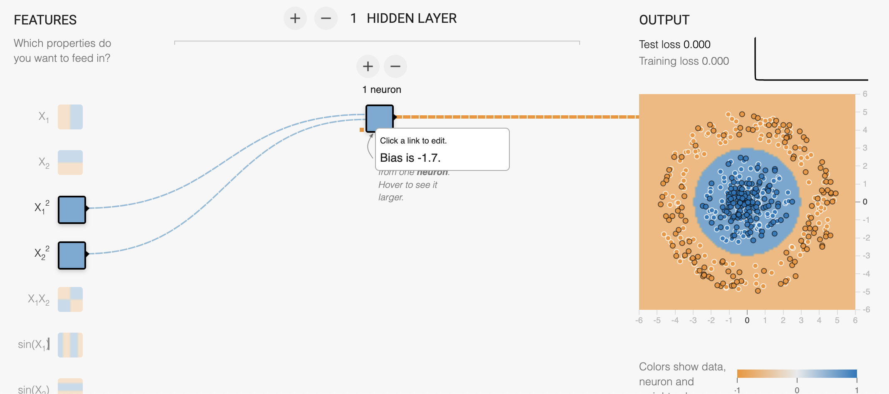

CNN_CIFAR

Q1: Is there anything we need to know to get your code to work? If you did not get your code working or handed in an incomplete solution please let us know what you did complete (0-4 sentences)

The Python execution environment and dependencies include Python 3.10.9 along with Matplotlib 3.7.1 and Tensorflow 2.12.0(2.13.0).

If no parameter is provided, the assignment.py script will search for the CIFAR_data directory in the current working directory to load the data. Alternatively, you can assign a specific path using a parameter to indicate the directory containing the CIFAR_data folder.

```{python}
python3 assignment.py
```

```{python}
# eg. /Users/jzh205/CIFAR_data

python3 assignment.py $PATH_TO_CIFAR
```

The unit test case code remained unchanged, but modifications were made to the way the loss function is referenced, allowing all test cases to pass successfully.

```{python}
python3 assignment_tests.py
```

```{python}
import assignment as am

def loss(logits, labels):
    return np.mean(am.loss(logits, labels))
```

2. Q2: Consider the three following 23x23 images of the digit 3.  Which neural net is better suited for identifying the digit in each image: a convolutional neural net or a feed-forward (multi-layer linear+ReLU) neural network? Explain your reasoning. (2-3 sentences)



A convolutional neural network (CNN) is more suitable for image digit recognition than a feed-forward neural network. CNNs exhibit a degree of translational invariance, enhancing resistance to input alterations, and excel in capturing local patterns and spatial relationships in images, which is essential for discerning digit shapes. In contrast, the latter concentrate on individual pixels, lack translational invariance, and are susceptible to overfitting with excessive layers or parameters, potentially leading to lengthier training computations due to increased parameters.

3. Q3: Consider the dataset shown in this scatterplot:
The orange points are labeled with class label 0, and the blue points are labeled with class label 1. Write out a mathematical expression in terms of the inputs, using linear layers and ReLUs, that will correctly classify all of these points.



Given inputs  \(X_1^2\)  and  \(X_2^2\), in a scenario with only one layer and one neuron with activation as Relu, the trained parameters are as follows: for the first layer with two inputs, the weights are 0.40 and 0.40, with a bias of -1.7. In the final layer, the output weight is -1.7 and bias 3.2.

$$ output = 3.2 - max(0， 0.40X_1^2 + 0.40X_2^2 -1.7) \times 1.7 $$

while \(output > 0 \), label = 1, \(output \le 0\), label = 0

Q4: Read about this [algorithm](https://www.technologyreview.com/2016/11/22/107128/neural-network-learns-to-identify-criminals-by-their-faces/), which claims to predict "criminality" based on peoples faces, and was created by researchers in China.

(a) What factors do the researchers claim contribute to “criminality?” (1-3 sentences)

The researchers claim there are three facial features that the neural network uses to make its classification.

- the curvature of upper lip, which is on average 23 percent larger for criminals than for noncriminals;
- the distance between two inner corners of the eyes, which is 6 percent shorter; 
- the angle between two lines drawn from the tip of the nose to the corners of the mouth, which is 20 percent smaller.

(b) What’s one potential confounding variable/feature that their algorithm learned? What’s your evaluation of the "effectiveness" of this algorithm? (2-4 sentences)

The dataset comprises only 1856 Chinese men ID photos between the ages of 18 and 55 with no facial hair, and half of them are labeled as "criminals," which significantly exceeds the actual crime rate in the general population and there exists a sample bias, and biological features influenced by factors such as age, gender, ethnicity, and region may be erroneously associated with criminality. Additionally, the small dataset size raises the possibility of overfitting.

When the consequences of false positives (FP) are substantial, recall might be a more crucial indicator. According to the paper's discussion, when an individual is classified as a "Criminal" by the model, based on Bayesian principles and considering the background of China's crime rate, the actual probability of being a criminal is 4.39%. Hence, the model is practically nonviable. Given the significant ramifications of misclassification, a system of this nature should be handled with utmost caution and should never hastily claim to "make reliable inference on criminality." 

(c) If this algorithm were actually deployed, what are the consequences of this algorithm making a mistake (misclassification)? (1-3 sentences)

False positives could lead to innocent individuals being unjustly accused or subjected to surveillance. This study has raised significant ethical and moral concerns. Using facial images to predict criminal tendencies may result in discriminatory predictions based on factors such as race, gender, and socioeconomic status, thus perpetuating biases and inequality.
